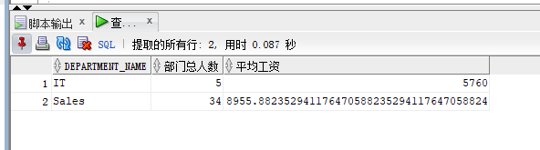
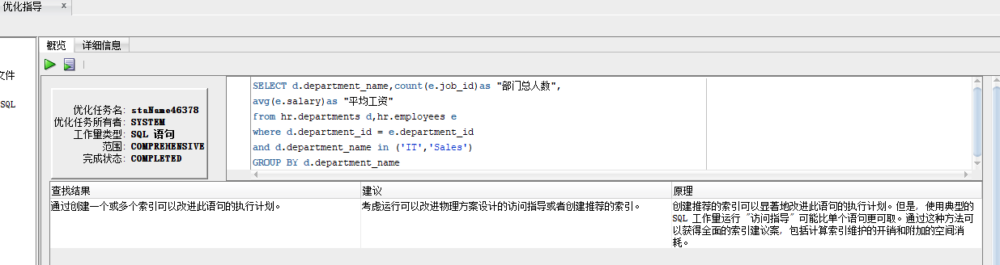
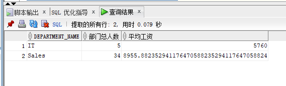
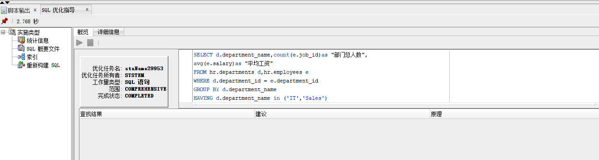
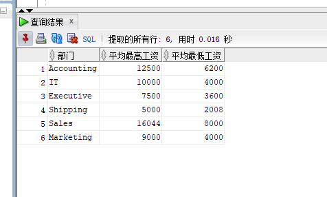
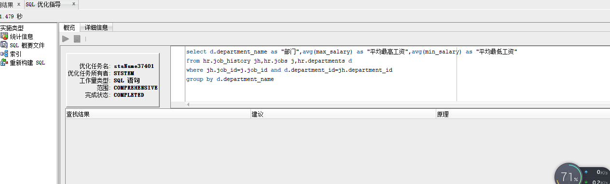

# 第一次作业
## 王涛 18软工三班 201810414319 
### 实验目的：
分析SQL执行计划，执行SQL语句的优化指导。理解分析SQL语句的执行计划的重要作用。
### 实验内容：
对Oracle12c中的HR人力资源管理系统中的表进行查询与分析。
首先运行和分析教材中的样例：本训练任务目的是查询两个部门('IT'和'Sales')的部门总人数和平均工资，以下两个查询的结果是一样的。但效率不相同。
设计自己的查询语句，并作相应的分析，查询语句不能太简单。
***

### 教材的查询语句1：
```

SELECT d.department_name,count(e.job_id)as "部门总人数",
avg(e.salary)as "平均工资"
from hr.departments d,hr.employees e
where d.department_id = e.department_id
and d.department_name in ('IT','Sales')
GROUP BY d.department_name;
```
sql语句查询的结果为：


执行优化的结果为：


***
### 教材的查询语句2：
```
SELECT d.department_name,count(e.job_id)as "部门总人数",
avg(e.salary)as "平均工资"
FROM hr.departments d,hr.employees e
WHERE d.department_id = e.department_id
GROUP BY d.department_name
HAVING d.department_name in ('IT','Sales');
```
sql语句查询的结果为：


执行的优化结果为：


***
设计的sql语句
```
/*查询每个部门的最高平均工资和最低平均工资*/
select d.department_name as "部门",avg(max_salary) as "平均最高工资",avg(min_salary) as "平均最低工资"
from hr.job_history jh,hr.jobs j,hr.departments d
where jh.job_id=j.job_id and d.department_id=jh.department_id
group by d.department_name
```
sql查询的结果为：


执行优化结果为：


### sql语句分析
* 通过主键将三张表连接起来，然后查询出所需要的数据，再通过group by进行分组，用avg函数求出平均值。
* 这里也可以采用嵌套查询，两者的区别是在查询数据量特别大的时候，嵌套查询的速度会比联合查询慢很多。