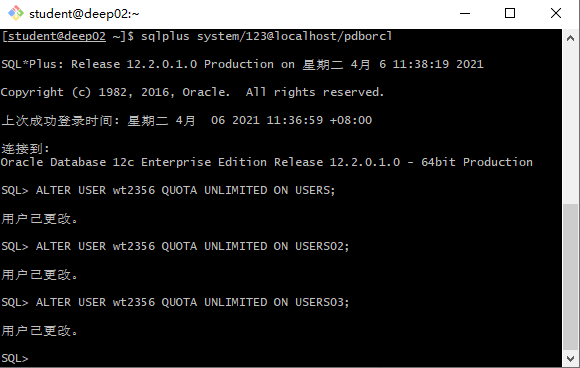
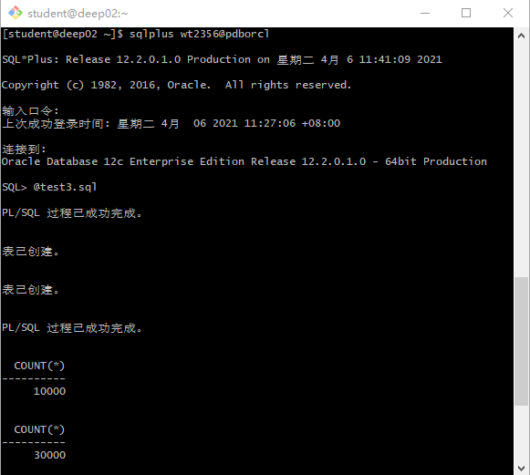
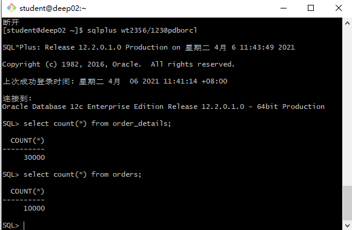
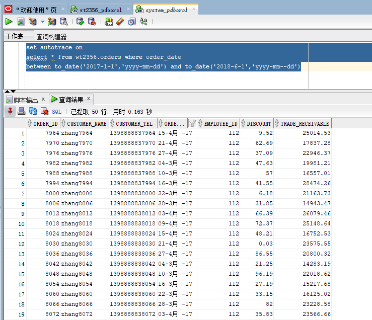
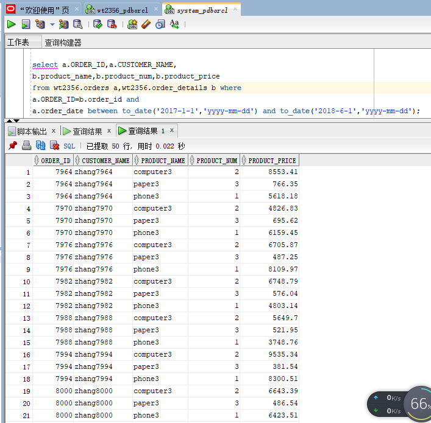
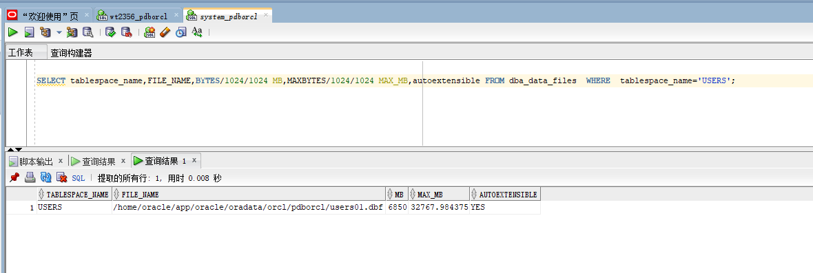
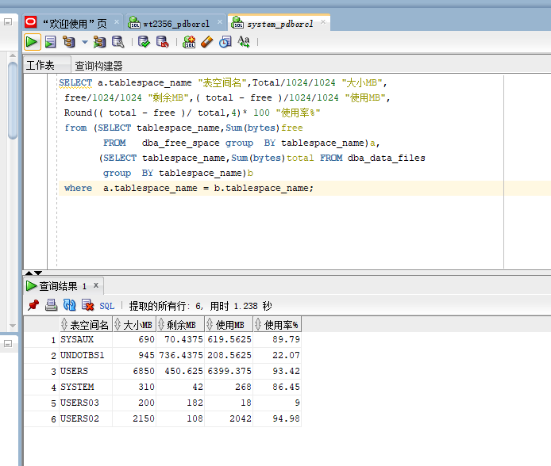

# 实验3：创建分区表
## 王涛 201810414319 软工三班
## 实验目的：
掌握分区表的创建方法，掌握各种分区方式的使用场景。
## 实验内容：
* 本实验使用3个表空间：USERS,USERS02,USERS03。在表空间中创建两张表：订单表(orders)与订单详表(order_details)。
* 使用你自己的账号创建本实验的表，表创建在上述3个分区，自定义分区策略。
* 你需要使用system用户给你自己的账号分配上述分区的使用权限。你需要使用system用户给你的用户分配可以查询执行计划的权限。
* 表创建成功后，插入数据，数据能并平均分布到各个分区。每个表的数据都应该大于1万行，对表进行联合查询。
* 写出插入数据的语句和查询数据的语句，并分析语句的执行计划。
* 进行分区与不分区的对比实验。
## 实验步骤：
1. 用system登录，更改wt2356用户状态


2. 登录wt2356账户，运行test3.sql文件


3. 查看运行结果


4. 以system用户登录，执行简单查询和联表查询
* 简单查询：
```
select * from your_user.orders where order_date
between to_date('2017-1-1','yyyy-mm-dd') and to_date('2018-6-1','yyyy-mm-dd');
```
运行结果：


* 联表查询：
```
select a.ORDER_ID,a.CUSTOMER_NAME,
b.product_name,b.product_num,b.product_price
from your_user.orders a,your_user.order_details b where
a.ORDER_ID=b.order_id and
a.order_date between to_date('2017-1-1','yyyy-mm-dd') and to_date('2018-6-1','yyyy-mm-dd');
```

运行结果：


5. 查看表空间的数据库文件，以及每个文件的磁盘占用情况。
```
SELECT tablespace_name,FILE_NAME,BYTES/1024/1024 MB,MAXBYTES/1024/1024 MAX_MB,autoextensible FROM dba_data_files  WHERE  tablespace_name='USERS';
```


```
SELECT a.tablespace_name "表空间名",Total/1024/1024 "大小MB",
 free/1024/1024 "剩余MB",( total - free )/1024/1024 "使用MB",
 Round(( total - free )/ total,4)* 100 "使用率%"
 from (SELECT tablespace_name,Sum(bytes)free
        FROM   dba_free_space group  BY tablespace_name)a,
       (SELECT tablespace_name,Sum(bytes)total FROM dba_data_files
        group  BY tablespace_name)b
 where  a.tablespace_name = b.tablespace_name;
```


## 实验总结
通过这次的实验，学会了如何对Oracle进行分区，也学会了如何自定义分区策略。

Oracle分区的优点也十分明显：

1. 分区技术使数据库的可管理性变得更加容易。
2. 分区可以提高表的查询性能，SQL语句的where子句会过滤掉不需要的分区，oracle不会再扫描那些不需要的分区。
3. 分区技术减少数据的不可用时间，用户可以单独维护一个分区中的数据，而不影响其他分区中数据的使用。
4. 分区技术在数据库级完成，几乎不需要对应用程序做任何修改。

同时，这次也让我了解到Oracle分区方法有几种：
1. 范围分区：根据表中列值的范围将整个表分成不同的部分，如按照时间进行范围分区。
2. 列表分区：使用列表值将表划分成几部分。
3. 哈希分区：使用哈希函数把表分成几部分。
4. 复合分区：同时使用两种分区方法对表进行分区。