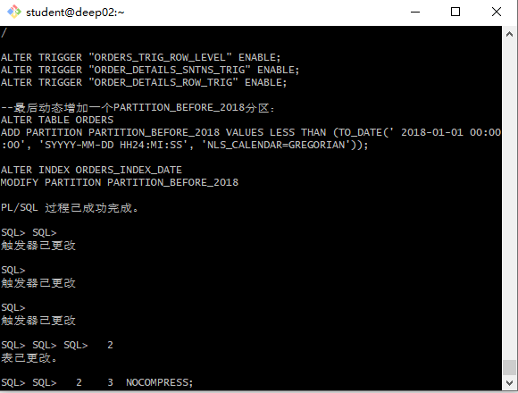
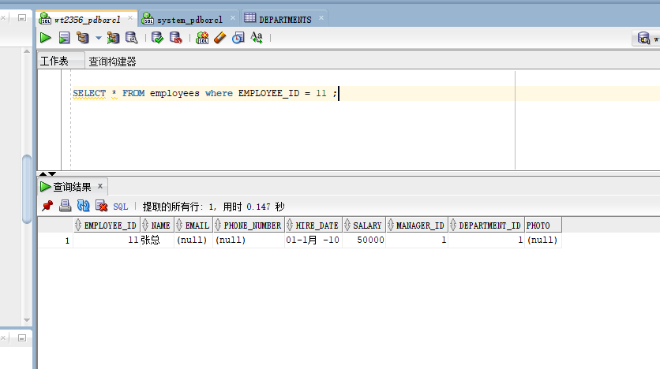
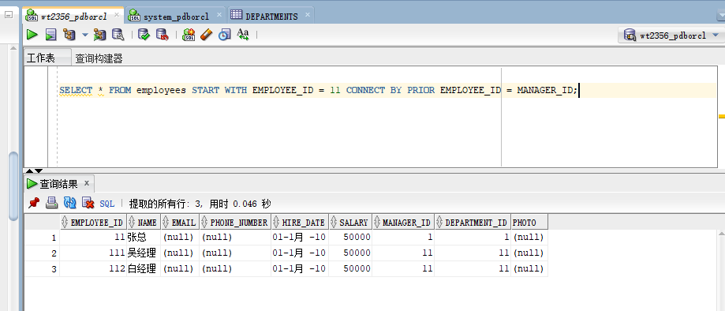
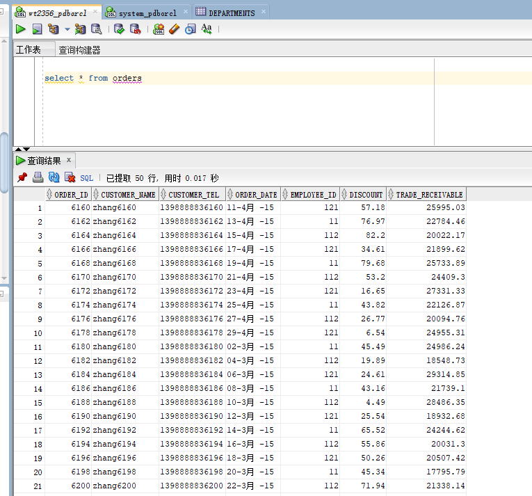
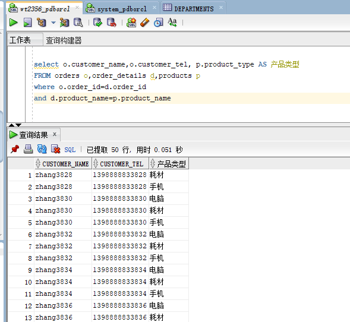
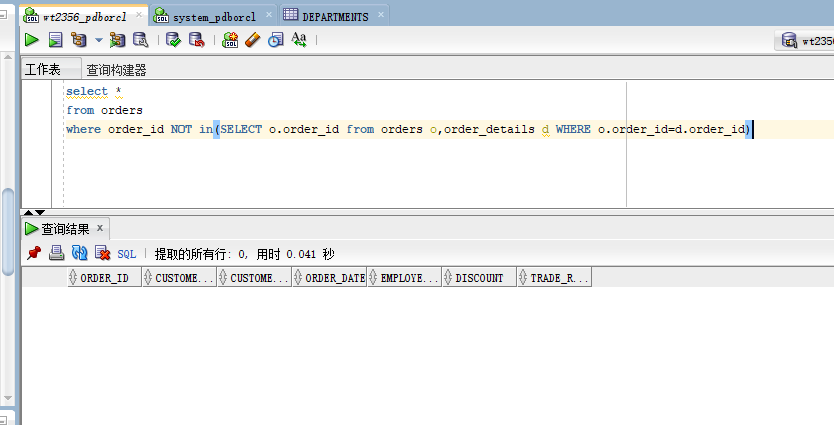
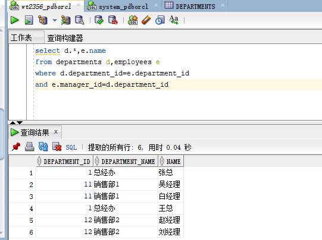
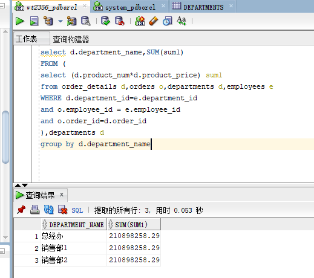

# 实验3：创建分区表
## 王涛 201810414319 软工三班
## 实验目的：
了解Oracle表和视图的概念，学习使用SQL语句Create Table创建表，学习Select语句插入，修改，删除以及查询数据，学习使用SQL语句创建视图，学习部分存储过程和触发器的使用。
## 实验场景：
假设有一个生产某个产品的单位，单位接受网上订单进行产品的销售。通过实验模拟这个单位的部分信息：员工表，部门表，订单表，订单详单表。
## 实验内容：
1. 录入数据：
要求至少有1万个订单，每个订单至少有4个详单。至少有两个部门，每个部门至少有1个员工，其中只有一个人没有领导，一个领导至少有一个下属，并且它的下属是另一个人的领导（比如A领导B，B领导C）。
2. 序列的应用：
插入ORDERS和ORDER_DETAILS 两个表的数据时，主键ORDERS.ORDER_ID, ORDER_DETAILS.ID的值必须通过序列SEQ_ORDER_ID和SEQ_ORDER_ID取得，不能手工输入一个数字。
3. 触发器的应用：
维护ORDER_DETAILS的数据时（insert,delete,update）要同步更新ORDERS表订单应收货款ORDERS.Trade_Receivable的值。
4. 查询数据：
```
1.查询某个员工的信息
2.递归查询某个员工及其所有下属，子下属员工。
3.查询订单表，并且包括订单的订单应收货款: Trade_Receivable= sum(订单详单表.ProductNum*订单详单表.ProductPrice)- Discount。
4.查询订单详表，要求显示订单的客户名称和客户电话，产品类型用汉字描述。
5.查询出所有空订单，即没有订单详单的订单。
6.查询部门表，同时显示部门的负责人姓名。
7.查询部门表，统计每个部门的销售总金额。
```

## 实验步骤：
1. 登录wt2356账号，运行test4.sql文件

2. 查询某个员工的信息

3. 递归查询某个员工及其所有下属，子下属员工。

4. 查询订单表，并且包括订单的订单应收货款: Trade_Receivable= sum(订单详单表.ProductNum*订单详单表.ProductPrice)- Discount。

5. 查询订单详表，要求显示订单的客户名称和客户电话，产品类型用汉字描述。

6. 查询出所有空订单，即没有订单详单的订单。

7. 查询部门表，同时显示部门的负责人姓名。

8. 查询部门表，统计每个部门的销售总金额。


## 实验总结
通过这次的实验，我了解Oracle表和视图的概念，学习使用SQL语句Create Table创建表。也学会了表的增删查改，以及存过程及触发器的使用。总的来说，在有其他数据库的基础之上，应该是比较容易的，自己感觉到oracle和其他的数据库在数据量上有很大的差别。

存储过程极大的节省了用户的时间，也提高了程序的执行效率。

触发器是一种特殊的存储过程，触发器一般由事件触发并且不能接受参数，存储器由语句块去调用。