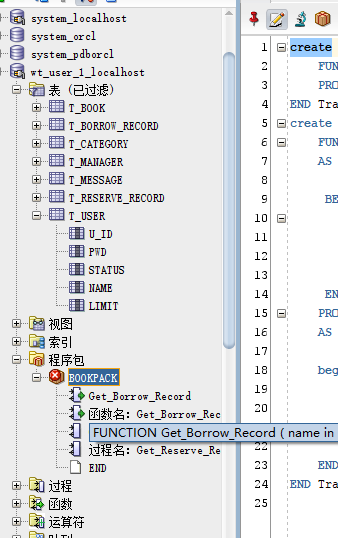

# Test6 图书借阅系统Oracle数据库设计

## 201810414319 王涛 18级软件工程3班

### 期末考核要求

* 设计项目涉及的表及表空间使用方案。至少5张表和5万条数据，两个表空间。
* 设计权限及用户分配方案。至少两类角色，两个用户。
* 在数据库中建立一个程序包，在包中用PL/SQL语言设计一些存储过程和函数，实现比较复杂的业务逻辑，用模拟数据进行执行计划分析。
* 设计自动备份方案或则手工备份方案。

## 一：搭建本地Oracle环境，登录进入Oracle

```
//测试登录
//使用sqlplus，输入用户名和密码
sqlplus system/AbAch12138
```

运行结果：


## 二：创建表空间
space_wt1
```
Create Tablespace space_wt1
datafile
'E:/oracle/data/oradata/orcl/pdborcl/pdbtest_wt1_1.dbf'
  SIZE 100M AUTOEXTEND ON NEXT 256M MAXSIZE UNLIMITED,
'E:/oracle/data/oradata/orcl/pdborcl/pdbtest_wt1_2.dbf'
  SIZE 100M AUTOEXTEND ON NEXT 256M MAXSIZE UNLIMITED
EXTENT MANAGEMENT LOCAL SEGMENT SPACE MANAGEMENT AUTO;
```
space_wt2
```
Create Tablespace space_wt2
datafile
'E:/oracle/data/oradata/orcl/pdborcl/pdbtest_wt2_1.dbf'
  SIZE 100M AUTOEXTEND ON NEXT 256M MAXSIZE UNLIMITED,
'E:/oracle/data/oradata/orcl/pdborcl/pdbtest_wt2_2.dbf'
  SIZE 100M AUTOEXTEND ON NEXT 256M MAXSIZE UNLIMITED
EXTENT MANAGEMENT LOCAL SEGMENT SPACE MANAGEMENT AUTO;
```

运行结果：


## 三、创建用户及角色
用户默认使用表空间space_wt1  
创建角色wt_role_1及用户wt_user_1
```
CREATE ROLE wt_role_1;
  GRANT connect,resource,CREATE VIEW TO wt_role_1;
  CREATE USER wt_user_1 IDENTIFIED BY 123 DEFAULT TABLESPACE space_wt1 TEMPORARY TABLESPACE temp;
  ALTER USER wt_user_1 QUOTA 60M ON space_wt1;
  GRANT wt_role_1 TO wt_user_1;
```
运行结果：


创建角色wt_role_2及用户wt_user_2
```
CREATE ROLE wt_role_2;
  GRANT connect,resource,CREATE VIEW TO wt_role_2;
  CREATE USER wt_user_2 IDENTIFIED BY 123 DEFAULT TABLESPACE space_wt2 TEMPORARY TABLESPACE temp;
  ALTER USER wt_user_2 QUOTA 60M ON space_wt1;
  GRANT wt_role_2 TO wt_user_2;
```
运行结果：


## 四、创建数据表
### 数据表分析：

***
1.用户表

| 字段 | 类型 | 是否为空 | 主/外键 | 默认值 |说明|
| ---- | ---- | -------- | ------- | ------ | ----- |
| u_id |number(10) |     否     |     主键    |        |用户id|
| pwd  |VARCHAR2(30 BYTE)|     否     |         |        |密码|
|status|number(1)|      否    |         |        |状态|
| name |VARCHAR2(50 BYTE)|      否    |         |        |名字|
|limit |number(3)|      否    |         |    20    |借书限额|

***
2.图书表
| 字段 | 类型 | 是否为空 | 主/外键 | 默认值 |说明|
| ---- | ---- | -------- | ------- | ------ | ------ |
| b_id |number(10) |     否     |     主键    |        |图书id|
| writer  |VARCHAR2(50 BYTE)|     否     |         |        |作者|
|name|VARCHAR2(50 BYTE)|      否    |         |        |名字|
|publisher|VARCHAR2(50 BYTE)|      否    |         |        |出版社|
|price |number(10,2)|      否    |         |        |价格|
|all_num|int|      否    |         |        |图书总数量|
|borrow_num |int|      否    |         |        |可借数量|
|c_id |number(10)|      否    |     外键    |        |类别id|

***
3.管理员表
| 字段 | 类型 | 是否为空 | 主/外键 | 默认值 |说明|
| ---- | ---- | -------- | ------- | ------ | ----- |
| m_id |number(10) |     否     |     主键    |        |管理员id|
| name  |VARCHAR2(50 BYTE)|     否     |         |        |管理员名字|
|tel|VARCHAR2(20 BYTE)|      否    |         |        |管理员联系方式|
| pwd |VARCHAR2(30 BYTE)|      否    |         |        |密码|

***
4.图书类别表
| 字段 | 类型 | 是否为空 | 主/外键 | 默认值 |说明|
| ---- | ---- | -------- | ------- | ------ | ----- |
| c_id |number(10) |     否     |     主键    |        |图书类别id|
| text  |VARCHAR2(20 BYTE)|     否     |         |        |图书类别|

***
5.借阅记录表
| 字段 | 类型 | 是否为空 | 主/外键 | 默认值 |说明|
| ---- | ---- | -------- | ------- | ------ | ----- |
| br_id |number(10) |     否     |     主键    |        |借阅记录id|
| b_id |number(10) |     否     |     外键    |        |图书id|
| u_id |number(10) |     否     |     外键    |        |用户id|
| borrow_time |Date|     否     |             |        |借书时间|
| return_time |Date|     是     |             |        |还书时间|
| status |int|     否     |             |        |状态（1.未还，2.已还）|

***
6.预定图书表
| 字段 | 类型 | 是否为空 | 主/外键 | 默认值 |说明|
| ---- | ---- | -------- | ------- | ------ | ----- |
| rr_id |number(10) |     否     |     主键    |        |还书记录id|
| b_id |number(10) |     否     |     外键    |        |图书id|
| u_id |number(10) |     否     |     外键    |        |用户id|
| time |Date|     否     |             |        |预定时间|
| status |int|     否     |             |        |状态（1.预定中，2.预定成功）|

***
7.消息记录表
| 字段 | 类型 | 是否为空 | 主/外键 | 默认值 |说明|
| ---- | ---- | -------- | ------- | ------ | ----- |
| me_id |number(10) |     否     |     主键    |        |消息记录id|
| u_id |number(10) |     否     |     外键    |        |用户id|
| text |VARCHAR2(200 BYTE)|     否     |             |        |消息内容|
| time |Date|     否     |             |        |发送时间|


### 创建表
1.用户表
```
create table T_USER
(
u_id  number(10) primary key,
pwd  VARCHAR2(30 BYTE) not null,
status number(1) not null,
name VARCHAR2(50 BYTE) not null,
limit number(3)default 20  not null 
)
tablespace space_wt1
pctfree 10 
initrans 1 
maxtrans 255 
storage 
(
initial 64K 
next 1M
minextents 1 
maxextents unlimited 
);
```
***
2.图书类别表
```
create table T_CATEGORY
(
c_id  number(10) primary key,
text  VARCHAR2(20 BYTE) not null
)
tablespace space_wt1
pctfree 10 
initrans 1 
maxtrans 255 
storage 
(
initial 64K 
next 1M
minextents 1 
maxextents unlimited 
);
```
***
3.图书表
```
create table T_BOOK
(
b_id  number(10) primary key,
writer  VARCHAR2(50 BYTE) not null,
name VARCHAR2(50 BYTE) not null,
publisher VARCHAR2(50 BYTE) not null,
price number(10,2) not null,
all_num int not null,
borrow_num int not null,
c_id number(10),
constraint c_id foreign key(c_id) references T_CATEGORY(c_id)
)
tablespace space_wt1
pctfree 10 
initrans 1 
maxtrans 255 
storage 
(
initial 64K 
next 1M
minextents 1 
maxextents unlimited 
);
```

***
4.管理员表
```
create table T_MANAGER
(
m_id  number(10) primary key,
name  VARCHAR2(50 BYTE) not null,
tel VARCHAR2(20 BYTE) not null,
pwd VARCHAR2(30 BYTE) not null
)
tablespace space_wt1
pctfree 10 
initrans 1 
maxtrans 255 
storage 
(
initial 64K 
next 1M
minextents 1 
maxextents unlimited 
);
```

***
5.消息记录表
```
create table T_MESSAGE
(
me_id  number(10) primary key,
u_id   number(10), 
text VARCHAR2(200 BYTE) not null,
time date not null,
constraint u_id foreign key(u_id) references T_USER(u_id)
)
tablespace space_wt1
pctfree 10 
initrans 1 
maxtrans 255 
storage 
(
initial 64K 
next 1M
minextents 1 
maxextents unlimited 
);
```

***
6.借阅记录表
```
create table T_BORROW_RECORD
(
br_id  number(10) primary key,
u_id   number(10), 
b_id   number(10),
borrow_time date not null,
return_time date,
constraint br_u_id foreign key(u_id) references T_USER(u_id),
constraint b_id foreign key(b_id) references T_BOOK(b_id)
)
tablespace space_wt1
pctfree 10 
initrans 1 
maxtrans 255 
storage 
(
initial 64K 
next 1M
minextents 1 
maxextents unlimited 
);
```

7.预定记录表
```
create table T_RESERVE_RECORD
(
rr_id  number(10) primary key,
u_id   number(10), 
b_id   number(10),
time date not null,
status number(1),
constraint me_u_id foreign key(u_id) references T_USER(u_id),
constraint me_b_id foreign key(b_id) references T_BOOK(b_id)
)
tablespace space_wt1
pctfree 10 
initrans 1 
maxtrans 255 
storage 
(
initial 64K 
next 1M
minextents 1 
maxextents unlimited 
);
```

***
运行结果：


## 五、模拟插入数据
### 插入数据62200条
```
1.用户表：5000条
2.图书类别表：2000条
3.图书表：5000条
4.管理员类：200条
5.消息记录表：10000条
6.借阅记录表：20000条
7.预定记录表：20000条
```
### 1.用户表
```
declare
i int; 
u_id  number(10);
pwd  VARCHAR2(30 BYTE);
status number(1);
name VARCHAR2(50 BYTE);
limit number(3);
begin
i:=1;
while i<=5000
loop
u_id:=i;
name:= 'user'|| i;
pwd:= '123';
status:=1;
limit:=20;
insert into T_USER(u_id,pwd,status,name,limit) values (u_id,pwd,status,name,limit);
i:=i+1;
end loop;
commit;
end;
/
```

### 2.图书类别表
```
declare
i int; 
c_id   number(10);
text   VARCHAR2(20 BYTE);
begin
i:=1;
while i<=2000
loop
c_id:=i;
text:='第'||i||'类';
insert into T_CATEGORY(c_id,text) values (c_id,text);
i:=i+1;
end loop;
commit;
end;
/
```

### 3.图书表
```
declare
i int; 
j int;
k int;
b_id  number(10);
writer VARCHAR2(50 BYTE);
name VARCHAR2(50 BYTE);
publisher VARCHAR2(50 BYTE);
price number(10,2);
all_num int;
borrow_num int;
c_id number(10);
begin
i:=1;
while i<=5000
loop
b_id:=i;
j := dbms_random.value()*50;
writer:= '作者'||j;
name:='图书'||i;
k := dbms_random.value()*30;
publisher :='出版社'||k;
price :=dbms_random.value()*100;
all_num :=20;
borrow_num:=dbms_random.value()*20;
c_id:=dbms_random.value()*2000;
insert into T_BOOK(b_id,writer,name,publisher,price,all_num,borrow_num,c_id) values (b_id,writer,name,publisher,price,all_num,borrow_num,c_id);
i:=i+1;
end loop;
commit;
end;
/
```
### 4.管理员表
```
declare
i int; 
j int;
k int;
m_id   number(10);
name  VARCHAR2(50 BYTE);
tel VARCHAR2(20 BYTE);
pwd VARCHAR2(30 BYTE);
begin
i:=1;
while i<=200
loop
m_id:=i;
name:='管理员'||i;
tel:='13333333333';
pwd:='123456';
insert into T_MANAGER(m_id,name,tel,pwd) values (m_id,name,tel,pwd);
i:=i+1;
end loop;
commit;
end;
/
```
### 5.消息记录表
```
declare
i int;
me_id number(10);
u_id number(10);
text VARCHAR2(200 BYTE);
time date;
begin
i:=1;
while i<=10000
loop
me_id:=i;
text := '您预定的图书已有剩余';
u_id := dbms_random.value()*4000+1;
if i mod 6 = 0 then
  time:= to_date('2015-3-2','yyyy-mm-dd')+(i mod 60);
elsif i mod 6 =1 then
  time:=to_date('2016-3-2','yyyy-mm-dd')+(i mod 60);
elsif i mod 6 =2 then
  time:=to_date('2017-3-2','yyyy-mm-dd')+(i mod 60);
elsif i mod 6 =3 then
  time:=to_date('2018-3-2','yyyy-mm-dd')+(i mod 60);
elsif i mod 6 =4 then
  time:=to_date('2019-3-2','yyyy-mm-dd')+(i mod 60);
else
  time:=to_date('2020-3-2','yyyy-mm-dd')+(i mod 60);
end if;
insert into T_MESSAGE(me_id,u_id,text,time) values (me_id,u_id,text,time);
i:=i+1;
end loop;
commit;
end;
/
```

### 6.借阅记录表
```
declare
i int;
br_id  number(10);
u_id number(10);
b_id number(10);
borrow_time date;
return_time date;
begin
i:=1;
while i<=20000
loop
br_id:=i;
u_id:=dbms_random.value()*4000+1;
b_id:=dbms_random.value()*4000+1;
if i mod 6 = 0 then
    borrow_time:= to_date('2015-3-2','yyyy-mm-dd')+(i mod 60);
    return_time:= to_date('2015-3-5','yyyy-mm-dd')+(i mod 60);
elsif i mod 6 =1 then
    borrow_time:=to_date('2016-3-2','yyyy-mm-dd')+(i mod 60);
elsif i mod 6 =2 then
    borrow_time:=to_date('2017-3-2','yyyy-mm-dd')+(i mod 60);
    return_time:= to_date('2017-3-5','yyyy-mm-dd')+(i mod 60);
elsif i mod 6 =3 then
    borrow_time:=to_date('2018-3-2','yyyy-mm-dd')+(i mod 60);
    return_time:= to_date('2018-3-5','yyyy-mm-dd')+(i mod 60);
elsif i mod 6 =4 then
    borrow_time:=to_date('2019-3-2','yyyy-mm-dd')+(i mod 60);
    return_time:= to_date('2019-3-10','yyyy-mm-dd')+(i mod 60);
else
    borrow_time:=to_date('2020-3-2','yyyy-mm-dd')+(i mod 60);
    return_time:= to_date('2020-4-10','yyyy-mm-dd')+(i mod 60);
end if;
insert into T_BORROW_RECORD(br_id,u_id,b_id,borrow_time,return_time) values (br_id,u_id,b_id,borrow_time,return_time);
i:=i+1;
end loop;
commit;
end;
/
```
### 7.预定记录表
```
declare
i int;
rr_id  number(10);
u_id number(10);
b_id number(10);
time date;
status number(1);
begin
i:=1;
while i<=20000
loop
rr_id:=i;
u_id:=dbms_random.value()*4000+1;
b_id:=dbms_random.value()*4000+1;
status:=dbms_random.value()*2+1;
if i mod 6 = 0 then
    time:= to_date('2015-3-2','yyyy-mm-dd')+(i mod 60);
elsif i mod 6 =1 then
    time:=to_date('2016-3-2','yyyy-mm-dd')+(i mod 60);
elsif i mod 6 =2 then
    time:=to_date('2017-3-2','yyyy-mm-dd')+(i mod 60);
elsif i mod 6 =3 then
    time:=to_date('2018-3-2','yyyy-mm-dd')+(i mod 60);
elsif i mod 6 =4 then
    time:=to_date('2019-3-2','yyyy-mm-dd')+(i mod 60);
else
    time:=to_date('2020-3-2','yyyy-mm-dd')+(i mod 60);
end if;
insert into T_RESERVE_RECORD(rr_id,u_id,b_id,time,status) values (rr_id,u_id,b_id,time,status);
i:=i+1;
end loop;
commit;
end;
/
```

### 8.查询是否插入成功
```
select count(*) from T_USER;
select count(*) from T_BOOK;
select count(*) from T_BORROW_RECORD;
select count(*) from T_CATEGORY;
select count(*) from T_MANAGER;
select count(*) from T_MESSAGE;
select count(*) from T_RESERVE_RECORD;
select count(*) from T_USER;
```
运行结果：


## 六、创建程序包
```
包名：BookPack
函数名：Get_Borrow_Record 功能：输入用户名字，获取该用户借书的图书信息
过程名：Get_Reserve_Record 功能：输入用户名字，获取该用户预定图书的图书信息
```
```
--创建包
create or replace PACKAGE BookPack IS
    FUNCTION 函数名：Get_Borrow_Record(name VARCHAR2);
    PROCEDURE 过程名：Get_Reserve_Record(name VARCHAR2);
END TrainPack;
--创建函数和存储过程
create or replace PACKAGE BODY BookPack IS
    FUNCTION Get_Borrow_Record(name in VARCHAR2)
    AS

     BEGIN
       select * from T_USER u,T_BOOK b,T_BORROW_RECORD br 
       where u.u_id=br.u_id 
       and b.b_id=br.b_id 
       and u.name=name; 
     END;
    PROCEDURE Get_orders(name VARCHAR2)
    AS

    begin
        select * T_USER u,T_BOOK b,T_RESERVE_RECORD rr  
        where u.u_id=br.u_id 
        and b.b_id=rr.b_id 
        and u.name=name; 
    END;
END TrainPack;
```
运行结果：


### 测试函数和存储过程
```
DECLARE
begin
    Get_Borrow_Record('user1');
end;
DECLARE
begin
    Get_Borrow_Record('user1');
end;
```
运行结果:


## 七、设计手动备份
```
-- 数据备份
create directory dpdata1 as 'F:\ORACLE\copy';
select * from dba_directories;
-- 开始备份
-- 授权给用户
grant read,write on directory dpdata1 to wt_user_1;
```
运行结果：


备份：
```
expdp system/AbAch12138@ORCL directory=dpdata1 dumpfile=beifen.dmp logfile=beifen.log schemas=wt_user_1
```
结果：
